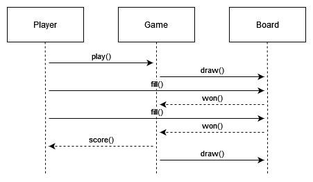

# tic-tac-toe

The following information shows a brief draft of the design process. It is not an accurate description of what you will find if you navigate the source code.

## Use Case

The player draws a board that consists of a three-by-three grid. One of the two players writes an X on one of the empty entries. Then, the other player writes an O in one of the empty cells. The process continues until one of the players has written three consecutive characters or has failed to do so. A player wins if he accomplishes the previously mentioned task; otherwise, players tie.

## Domain Model

## Sequence Diagram

## Class Diagram

## References

Larman, C. (2005). Applying UML and patterns: An introduction to object-oriented analysis and design and the Unified Process. Prentice Hall.